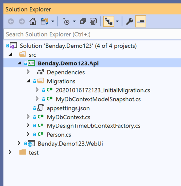
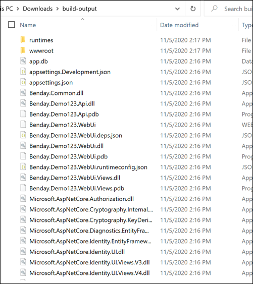

# Deploy Entity Framework Core Migrations from a DLL

This action helps you to deploy Entity Framework (EF Core) migrations from a DLL instead of from the source code.  This is helpful when you are deploying pre-compiled code during a release workflow.  

### How to use this

In order to use this action, it's probably helpful to show you some sample code.  Let's say that you have a solution like the one below.  There's an MVC project (Benday.Demo123.WebUi) and a class library project (Benday.Demo123.Api).  The Migrations are in the Benday.Demo123.API project.  NOTE: When the application runs, the startup assembly is going to be the web project (Benday.Demo123.WebUi).  In this sample code, the DbContext class that governs the migrations is `MyDbContext`.



If you're going to distribute this application in compiled form, you'd go to the command line and run `dotnet build` followed by `dotnet publish -o build-output`.  The `dotnet publish` command publishes the compiled code and all of it's dependencies to a directory.  The `-o build-output` argument specifies the location to publish to -- in this case, a directory called `build-output`.  After running `dotnet publish` you'll have a directory with contents that look something like the image below.  



This action assumes that you have already configured the connection string for the EF Core migration code.  Figuring out how EF Core migrations are going to choose a connection string can sometimes be a little unpredictable.  In order to make your life easier, I'd highly recommend [adding an implementation of IDesignTimeDbContextFactory to your project](https://www.benday.com/2017/12/19/ef-core-2-0-migrations-without-hard-coded-connection-strings/).

## Usage

To deploy entity framework migrations:  
```yaml
- name: deploy entity framework core migrations
  uses: benday-inc/deploy-ef-core-migration@main
  with:
  	path_to_directory: '${{ github.workspace }}/build-output'
  	migrations_dll: 'Benday.Demo123.Api.dll'
  	migrations_namespace: 'Benday.Demo123.Api'
  	startup_dll: 'Benday.Demo123.WebUi.dll'
  	dbcontext_class_name: 'MyDbContext'

```

----
## Action Spec:

### Environment variables
- None

### Inputs
- `path_to_directory` - path to directory that contains the compiled code and its dependencies (HINT: the output from `dotnet publish`)
- `migrations_dll` - filename of the DLL that contains your migrations
- `migrations_namespace` - .NET namespace for the DbContext class
- `startup_dll` - filename of the DLL that is the startup DLL for this published application
- `dbcontext_class_name` - Class name for the DbContext that controls the migrations to deploy

### Outputs
- None
